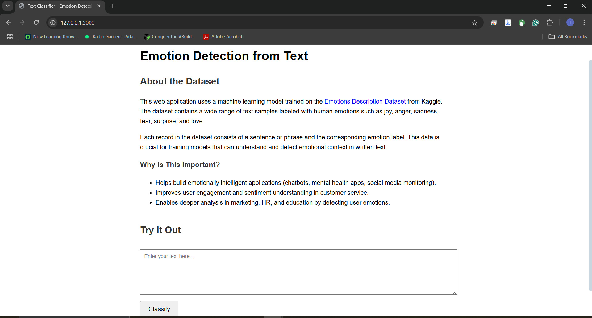
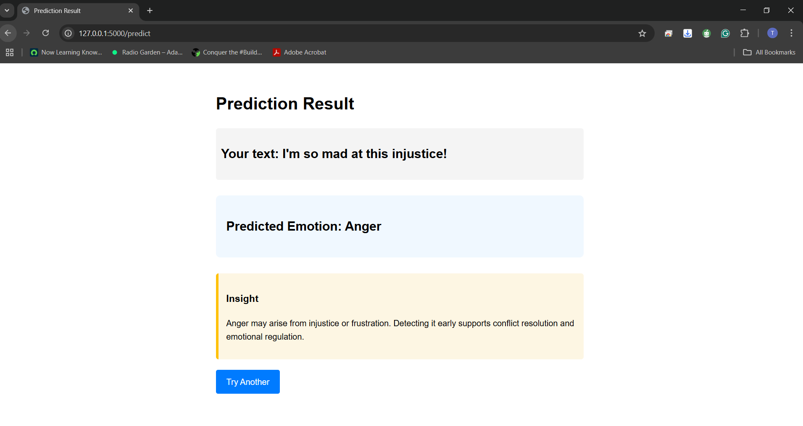

# 🧠 Text Emotion Classifier (Flask Deployment)

This project is a **text classification web app** that detects the **emotional sentiment** of user input using deep learning. It was trained on the [Emotion Description Dataset](https://www.kaggle.com/datasets/radedaevi/emotions-description), and supports 6 emotion classes:

- 😢 **Sadness**
- 😄 **Joy**
- ❤️ **Love**
- 😠 **Anger**
- 😨 **Fear**
- 😲 **Surprise**

---

## 📊 Dataset

We used the **Emotion Description Dataset**, which contains thousands of text samples labelled by emotion. This dataset is essential for building emotion-aware applications like mental health support, social listening tools, or conversational AI.

---

## 🧪 Model Training

The classification model was built using **TensorFlow** and **TF Hub's pre-trained sentence encoders**:

| Model Used                                                                 | Description                          |
|----------------------------------------------------------------------------|--------------------------------------|
| [`nnlm-en-dim50`](https://tfhub.dev/google/nnlm-en-dim50/2)               | ✅ Best performing, deployed         |
| [`nnlm-en-dim50-with-normalization`](https://tfhub.dev/google/nnlm-en-dim50-with-normalization/2) | Slightly lower accuracy             |
| [`nnlm-en-dim128-with-normalization`](https://tfhub.dev/google/nnlm-en-dim128-with-normalization/2) | Higher dimensional, more complex     |

The **`nnlm-en-dim50`** model achieved the best balance between **accuracy (≈86%)**, speed, and model size, and was selected for deployment.

---

## 🚀 Deployment

The best-performing model was deployed using a **Flask microservice**.

### 🌐 Features:
- Text input from the user
- Preprocessing (contraction expansion, stopword removal, etc.)
- Real-time emotion classification
- Insight and explanation of detected emotion

---

## 📷 Sample UI




---

## 🎥 Demo Video

[](https://www.youtube.com/watch?v=94NZjuqNnd8)

 

---


---

## 🛠️ Setup Instructions

```bash
# Create and activate a virtual environment
python -m venv .venv
source .venv/bin/activate  # or .venv\Scripts\activate on Windows

# Install dependencies
pip install -r requirements.txt

# Run the Flask app
python app.py
 
